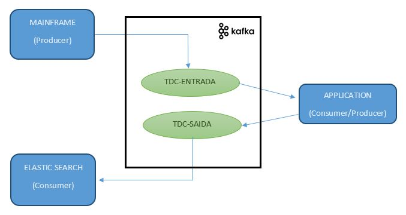

# Application to run Kafka Producer and Consumer using Python

This application is an example to learn more about the communication with Kafka. Here you have examples to run a simple application local host in Python

## Pre conditional
You will need to have Kafka Server in localhost with the following topics: tdc-entrada and tdc-saida. To install kafka serve in the localhost, you could see the article (it is in portugese): https://medium.com/@robsonagapito/subindo-o-kafka-em-localhost-no-windows-288c66b1b71a

We use Python 3 and the library confluent_kafka that it needs to be installed. We use package json too, however you will not install anything.

Example:
pip install confluent-kafka

## Application

### Process
The process handled by application is:

- main_frame.py is a producer, and it sends message to tdc-entrada topic (with value: <user>;<name>;<phone>).
- application.py is a consumer and a producer. It is the consumer of the topic tdc-entrada and it is the producer of the topic tdc-saida. During this process it consumes (tdc-entrada) the message and it converts this message in Json object and like producer sends json to topic tdc-saida.
- elastic_search.py is a consumer of the topic tdc-saida.

### Run 
You need to run in the following order:

#### 1-Consumers
- python application.py
- python elastic_search.py

#### 2-Producer
- python main_frame.py